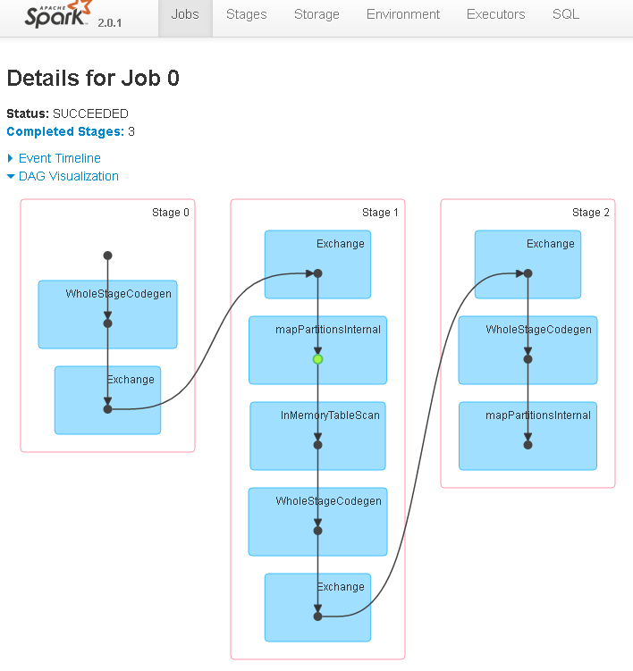
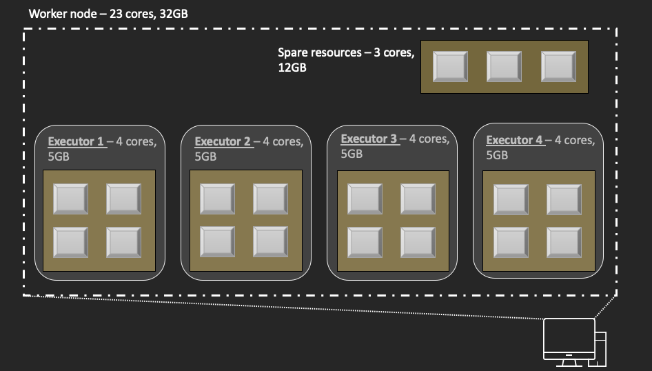
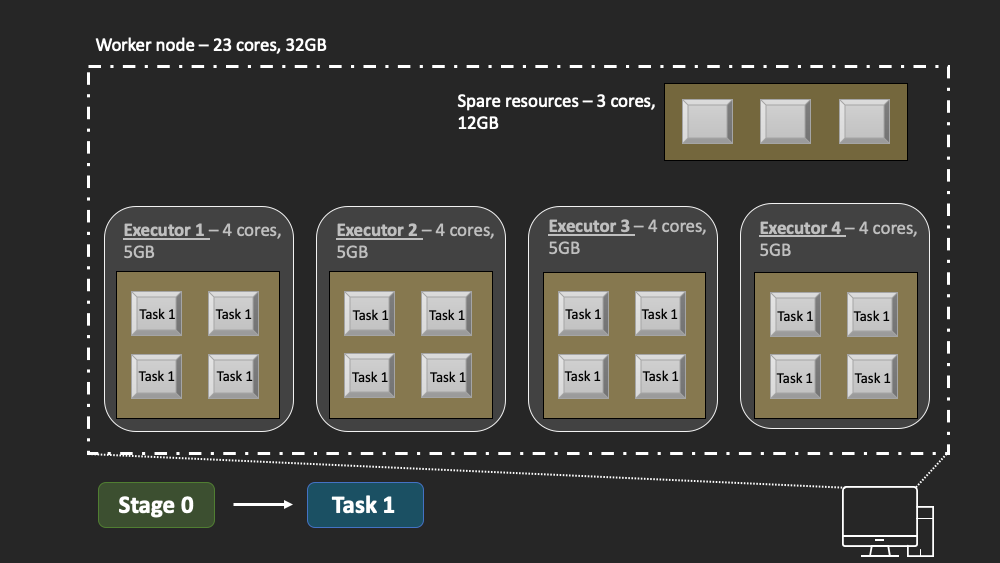

# Apache Spark

## Introduction
Here I am going to try to explain firstly the main terms you will hear when using Apache Spark
and then move on to how to tune a spark cluster for optimal performance.

## Apache Spark Terms & Architecture
To understand how to tune a Spark cluster for optimal performance the terms and structure of a
cluster need to be define and understood.

### Architecture
The basic architecture of an Apache Spark cluster is as follows

The three main nodes in a Spark cluster are the driver node, master node and the worker nodes
. The driver node holds the main() method and the spark context. In the spark context the user
defines how much of the cluster resources they wish to use for the program in the driver node
. From the driver node a user would submit their program to the cluster. 

The first step after submitting a program to the cluster is to communicate how much
resources the driver wants to the cluster manager (what I call the master node). The cluster
manager is the gate keeper of the cluster
. It knows how much resources the cluster has available at any moment in time as well as
which worker nodes are busy and which are free.

Next, the cluster manager then needs to acquire the requested resources from the worker nodes.

Then the cluster manager delegates the work to be carried out to the worker
nodes. The driver program then sends the program's code to the worker nodes that have been
assigned to do the work required. The worker nodes carry out the required work and
communicate the results directly back to the driver node. The cluster manager is responsible for
making sure the program is completed. For instance, if a worker node fails, it is the cluster
manager's responsibility to deletegate that worker node's work to another node.

That is the course-grained explanation of a Spark cluster's physical architecture. I will now go
on to explain what happens when you execute a program in a Spark cluster.

### Execution 
A user in spark specifies a series of transformations followed by an action. Once an action is
called in Spark an execution plan is built up behind the scenes. This is the series of steps
that each worker node needs to carry out on its piece of the data to return the result defined
by the action. This execution plan is called a **job**. 

Because of Spark's lazy evaluation, before the cluster executes the job Spark breaks the job down into **stages**. For example
, a single job could be broken down into 3 stages for example. Stage boundaries are defined by a
 point in the execution plan where the cluster would have to shuffle or move data around the
  cluster. I.e. the worker nodes now need data from other worker nodes. Common examples of a
   stage boundary is when a groupByKey() transformation is encountered in the execution plan.
   
Now that we know a stage is a set of work that a worker node can compute independently of the
other worker nodes we can break a stage down even further. A single stage gets broken down into
**tasks**. A task is a unit of work that can be computed in parallel on a single worker node. For
 example, if a worker node has 4 cores then the task can be run in parallel on these 4 cores. A
task boundary is defined as when a subsequent transformation needs the result of the previous
transformation to carry out its task. For example, reading in a text file and then splitting
 lines into key value pairs would be two tasks. The key value mapping transformation cannot
take place until the file has been read in to the worker nodes.  

All of this can be summarised into the diagram below. The diagram shows the directed acyclic
graph (DAG) for an example job. The DAG is what is created by Spark when you submit an
application and then this is converted by Spark to actually get a physical execution plan. You
can see that this single job is split into 3 stages. These stages are defined by the exchange
transformation because this operation requires data to be shuffled (exchanged) around the
cluster. Each stage is split into multiple tasks. Each tasks can be run in parallel on as
many cores as the user wishes.

A further subtly comes from the fact that within a worker node there is usually multiple
**executors**. Worker nodes are just machines or computers that attached to the Spark cluster. The
name is a bit misleading as it is the executors that actually do the work. The driver node
specifies when it submits an application how many cores each executor
should each have access to, and how much memory they should each have access to.

This is easiest to understand with an example. Let's say that the driver program submits an
application and asks for each executor to have 4 cores and each executor to have 5GB of RAM
. Lets also imagine that each worker node in the cluster is a machine in the cloud with 23 cores
and 32 GB of RAM on each machine. Spark will now try to create as many executors as possible on
each worker node. For this case I just described, where an executor should have 4 cores and
5GB of memory each worker node will create 4 executors. Thus of the 23 cores and 32GB of
memory on each worker node, 16 cores and 20GB of memory will be taken by the 4 executors
. See the image below. Therefore, there will be 3 cores and 12 GB of memory left over.
  
 

Now we submit a job to the cluster. If we concentrate on this worker node for now. Stage 0 is
 loaded and the DAG given for that stage which consists of 3 tasks. Now the 4 executors on this
  node start executing this tasks in parallel on all of the cores available to them. So you have
   16 cores running the same task with a different chunk of the data. This first task might be
    loading the data.
 
 

Once task 1 is finished the executor cores move on to task 2. At this point all the tasks are
 able to be run without any of the worker nodes, or executors having to communicate with each
  other. Let's imagine this second tasks is some map function that splits text up into words and
   make key value pairs such that (key: word, value: 1). So we create a dictionary where each
    word is the key and its value is 1 to show it has appeared in the text.

Now we define the next transformation which is a reduceByKey(). Because each of the workers have
 different chunks of data, to reduce by key the executors must communicate to shuffle their data
  aorund such that all key's for the word "hello" end up on one executor and then they can be
   reduced.
   

What happens is, first the executors perform a reduceByKey() locally on their chunk of data. And
 then all the workers nodes communicate to pass around key's. After the reshuffle a chunk of data
  contains all occurances of a particularly key. For example, after the shuffle all keys
   = "something" will be on one executor. Since the cluster had to shuffle data around we have
    defined a stage boundary, the final part of this reduce is now the start of a new stage.
    

This is how a Spark cluster divides up your program's job to execute in parallel.

### Terms
Here I put formal definitions of all the Spark specific terms I introduced in the previous section. 

NOTE: Some of these terms are terms that I use, I will denote these with a *.

| Term        | Definition           | Alias'  |
| ------------- |:-------------:| -----:|
| Driver node      | The machine where the main() method of your program resides | driver program, spark-submit node |
| Master node*      | The machine that runs your cluster manager (Standalone, YARN, Mesos)      |    |
| Worker node | A machine that's resources are available for use in a Spark application      |    |
| Cluster Manager | An external service for acquiring resources on the cluster. Is in charge of allocation of work      |    |
| Job | A parallel computation consisting of multiple tasks that gets spawned in response to a Spark action (e.g. save, collect); you'll see this term used in the driver's logs.     |    |
| Stage | Each job gets divided into smaller sets of tasks called stages that depend on each other (similar to the map and reduce stages in MapReduce); you'll see this term used in the driver's logs.   |    |
| Task |  A unit of work that will be sent to one executor. It is carried out in parallel on all the executor's cores  |    |

## Spark Tuning

Tuning Spark clusters seems to be quite a dark arts with not too much written on the subject
. Like anything it is job specific and so there is no free lunch here but these are the generals
rules of thumb to follow that should get you close to optimal performance in the majority of
situations.

I found the following two resources useful when trying to read up on tuning spark:
1. A 2-part blog post by [Cloudera](https://blog.cloudera.com/how-to-tune-your-apache-spark-jobs-part-1/)
2. Another 2-part blog post by Anthony Shipman from [C2FO.io](https://c2fo.io/c2fo/spark/aws/emr/2016/07/06/apache-spark-config-cheatsheet/)

Part 1 in the Cloudera blog post is good for gaining further understanding about how spark executes
your program, definitions of stages, tasks, etc. Whilst part 2 goes into the details of tuning
the parameters of your cluster for optimal performance.

Shipman's blogpost has taken the guidance from Cloudera on setting the parameters for a cluster
but he also includes a handy excel sheet that calculates these parameters for you. I have
included this [excel sheet](/resources/C2FO-Spark-Config-Cheatsheet.xlsx) in the resources folder.

Here I summarise my understanding of the tuning and later include some tests to demonstrate
 tuning a cluster.
 
### Cores & Memory
There are two main resources that your applications cares about when it gets submitted - cores
 and memory. Let's first focus on cores.
 
#### Cores
As depicted in the images in the previous section, when you submit a program to a Spark cluster
, the driver requests a certain number of cores per executor. The naive approach would be to
assign all the cores of a worker node to a single executor. For instance, if a worker node has
24 cores, then why not set the number of cores per executor to 24? For some reason, which is
gleaned from empirical evidence, is that assigning an executor more than 5 cores leads to bad
HDFS I/O throughput.

So first rule of thumb is to use a **maximum of 5 cores per executor**

*NOTE: I will say that everything online reccommends this figure when working with HDFS files. So
 for other file types this rule may not apply* 

If you're worker node only has 3 cores for instance, you would not assign spark.executor.cores=5
 as then your worker node would not be able to launch an executor.
 
Another thing to keep in mind is that taking all of the cores of a worker node is a bad idea as
 the machine still needs resources to run the OS and other bachground tasks.
 
 Therefore, the second rule of thumb is **the number of available cores on a worker node = cores
  on worker - 1**
  
So when you set up the worker node you would request # of cores on the worker node - 1 to be
 available for use by the cluster.
 
Example: you have a machine with 20 cores, you would set up the worker node on this machine with
19 cores, then when you submit a job you could set spark.executor.cores=4 which would create 4
 executors. 

Using 5 in this case would leave 4 cores unused, so selecting 4 only leaves 3 unused. Depending
on the task, you might be able to get by with 3 cores per executor, in which case you would only
have 1 core unused. This is where you have to start experimenting.

#### Memory
The second resource to configure is the memory. The first thing to consider, like with cores, is
 that the machine that is going to be the worker node still needs some memory to perform its
  basic functions.
  
Therefore, the first rule of thumb concerning memory is **the amount of available memory for a
 worker node = total memory on machine - 1GB**.
 
Now the amount of the worker's memory to assign a single executor depends on which cluster
 manager you are using. The advice regarding YARN, is that YARN requires some overhead in terms
  of memory for each executor which is given by max(384, 0.07*spark.executor.memory).
  
For example: you have a machine with 20 cores and 64GB of memory. Assign 1 core and 1GB of memory
for OS processes. Assign a max of 5 cores per executor, which gives 19/4 = 3 executors on a
worker node. Now the memory per executor should be 63/3 - (63/3(*0.07) = 21 - 1.47 ~ 19GB per
executor. It is best to round down the memory to the nearest integer as YARN will round up the
overhead memory. 

If using Standalone cluster manager then it is essentially the same except the overhead is max
(384, 0.10*spark.executor.memory)

Therefore, the second rule of thumb for memory is *take the worker node's memory and minus max(384
, 0.10\*worker node memory), then divide by the number of executors, this is the value of spark
.executor.memory*.

### Parallelism
One final, but very important parameter to set is the parallelism. Setting spark.default
.parallelism sets the number of partitions that new RDD's created will be split into. Setting
this too low, for instance to 1 in the extreme case, means you get 1 partition. Thus all your
data will end up being processed by 1 executor, even if you have 100 executors. In this case
you are not taking advantage of the parallelism of your cluster.

Setting this too high results in loads of tiny tasks which again is detrimental since there is a
 lot of overhead in managing many small tasks.
 
The advice from [Shipman's blog post](https://c2fo.io/c2fo/spark/aws/emr/2016/07/06/apache-spark-config-cheatsheet/) is to set spark.default.parallelism to 2-3 times the number of total cores
 of your executors.
 
I am speculating here but each core of an executor is able to carry out more than one job at a
time through multi-threading. It seems that executors are actually implemented as threads
rather than cores in Spark [[1]](https://freecontent.manning.com/running-spark-an-overview-of-sparks-runtime-architecture/). So even though an executor may have 4 cores assigned to it, if the
number of threads per core is 3, then really the executor can process 4*3=12 tasks at a time
. So in this case you would want your RDD to be split such that there is 12 partitions on an
 executor.
 
Therefore, my rule of thumb for parallelism is *spark.default.parallelism = total # of threads in
 your cluster*
 
For example: you have 2 worker nodes each with 20 cores. You leave 1 core per worker for the OS
, so you have 19 available. You set spark.executor.cores=5 and so you have 3 executors per node
. With 2 worker nodes you have 2 threads per core \*5 cores per executor\*3 executors per worker
 node\* 2 work nodes = 60.
 
 If working on a machine in the cloud you can actually find the number of threads per core for
  your machine such as here for [AWS](https://docs.aws.amazon.com/AWSEC2/latest/UserGuide/instance-optimize-cpu.html).

 

 
